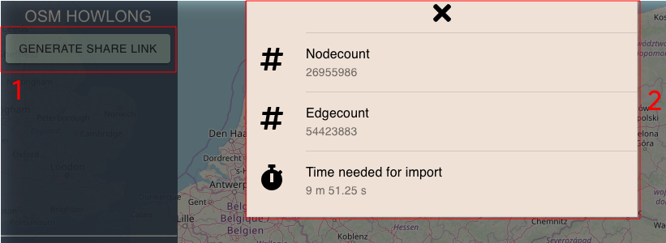
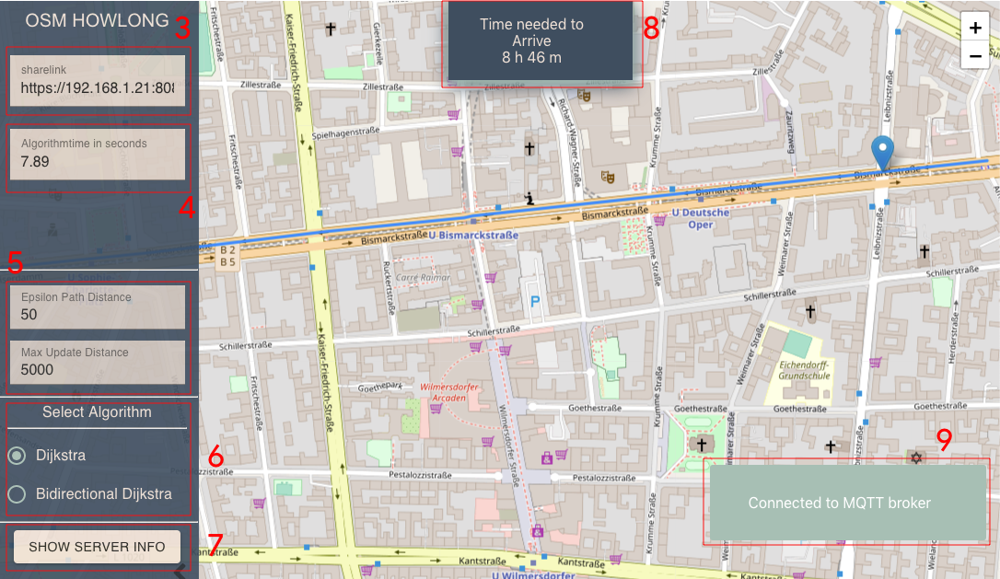

# osmfapra - share your route
In Case of the practical Course "OpenStreetMaps" an Application was designed to give your friend a chance to share his remaining arrival time with you. Send your friend a link and you will see his route. 

The communication is secure  cause of using the secured MQTT protocol. Multiple Algorithms for route calculation can be used.
 - Dijkstra
 - Bidirectional Dijkstra  


## How to Build
### [Option 1] Compile the Source
#### Requirements
- cmake >= 3.9
- protobuf >=3.6.1
- Boost >= 1.68.0
- Zlib >= 1.2.11
- make >=3.81
- gcc >= 7.3.0
- git 
- rabbitmq >= 3.7.17

In .scripts there are some example installation scripts. 
On Ubuntu 18.04 all requirements could be installed by running:
```bash
cd .scripts
sudo ./install-server_requirements.sh && \
sudo ./install-protobuf-sourcecode.sh && \
sudo ./install-rabbitmq.sh
```

For building the client some additional requirements are required:
- nodejs >= 12.7.0
- npm >=6.9

For example:
```bash
cd .scripts
sudo ./install-nodejs.sh
```

#### Client
```
cd ./client/
npm install
npm run-script build
```

#### Server

##### lib/osmpbf
```
cd server/libs/osmpbf
git submodule init
git submodule update --recursive --remote
cd generics && git submodule init && cd ..
git submodule update --recursive --remote
rm -rf ./build && mkdir -p build
rm -f CMakeCache.txt
cd build && cmake .. # (for mac instead use cmake . -B ./build && cd build)
make
```

##### lib/Simple-Web-Server  
Maybe done by step before
```bash
cd server/libs/Simple-Web-Server
git submodule init
git submodules update --recursive --remote
```

##### server
```bash
cd server/src/
make
```

##### Rabbitmq
1. generate certificate files 
To make the communication work on mobile devices all of the communication must be secured. In the data folder there are some example keys
- example.com-key.pem (The key for rabbitmq-wss and webserver)
- example.com.pem (the cert for the rabbitmq-wss and webserver)

To generate certificates for development you can use mkcert (https://github.com/FiloSottile/mkcert). If you want to use the certificate in npm development server. Just generate a new file with (cat example.com.pem example.com-key.pem > server.pem and use this as certificate in webpack. Start development server with HTTPS=true npm start.


2. config rabbitmq
Make sure that rabbitmq is not running
```bash
sudo rabbitmqctl stop
```

edit config file in data/docker_rabbitmq.config and enter the correct certificate path. Then copy the config file:
```bash
cp ./data/docker_rabbitmq.config /etc/rabbitmq/rabbitmq.config
```

3. Start and install plugins
```bash
export PATH=$PATH:/usr/local/opt/rabbitmq/sbin
rabbitmq-plugins enable rabbitmq_management rabbitmq_web_mqtt rabbitmq_mqtt
rabbitmq-server
```

#### Run
```bash
cd server
./main.out --path-to-pbf--
```
### [Option 2] Use Docker
#### Requirements  
- docker engine >= 19.03

#### Build  

Before you start building the Image, make sure you have copied the correct osm.pbf file into the data folder. Later you will pass the filename to the container environment   
```bash
docker build --no-cache -t osm .
```

#### run

```bash
docker run --name osmfapra -e PBFFILENAME=germany-latest.osm.pbf -p 8080:8080 -p 15672:15672 -p 15673:15673 osm
```

## Usage
First generate a sharelink with the button 1. 

{ width=400px}  

Share this link  (area 3) with your friend. After opening the link, the current position of your friend will be shared with you. In Area 9 you will receive several notifications. For Example connection informations. The remaining time to arrive will be shown in the area 8. In the configuration part 5 you can setup the "Epsilon path Distance" and the "Max Update Distance". Both are smoothing parameters to make the routing more stable.

|Parameter              |Description|
|-----------------------|----------------------------------------------------------------------------------------|
| Epsilon Path Distance | in an area of epsilon in meters the algorithm will choose a node of the current Route. |
| Max Update Distance   | for distances greater then epsilon in meters no request will be send.                  |

{ width=400px}  

Two Algorithms are implemented. In Area 6 you can choose which algorithm you want to use. In Area 4 the current calculation time of the Algorithm is shown If you are interested in some statistics of the graph import (e.g area 2) you can use button 6. 